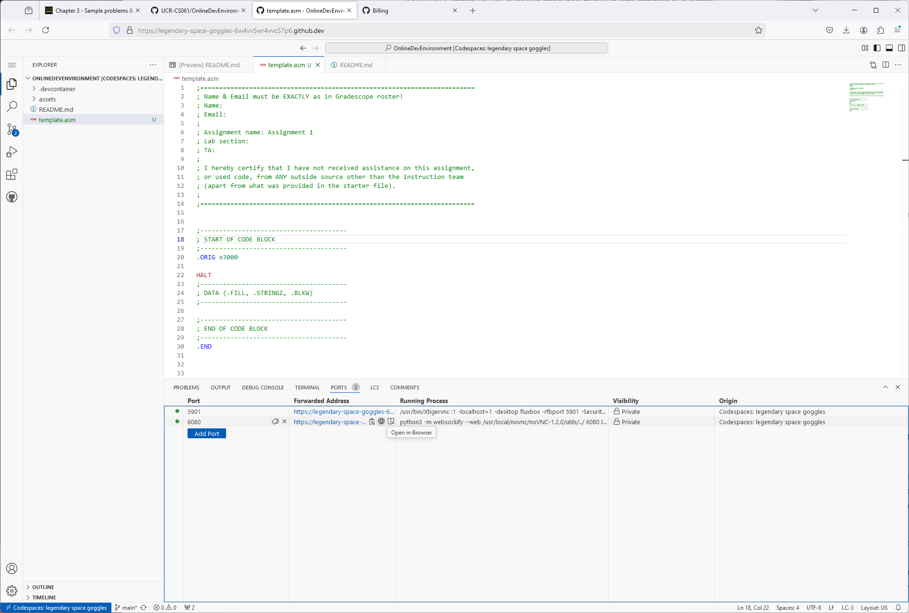
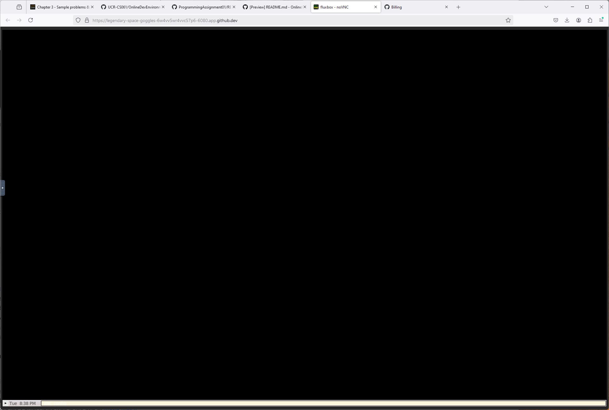
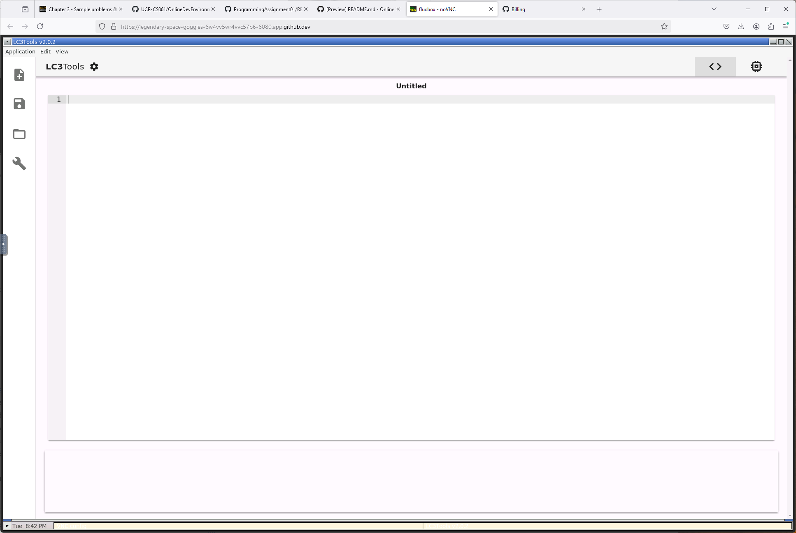
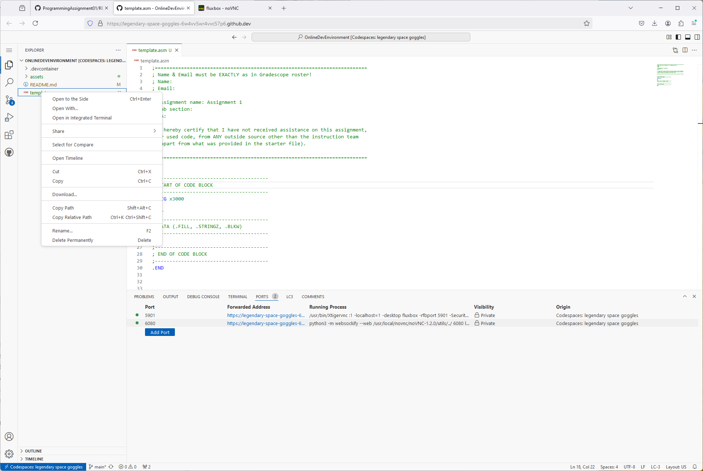

# CS061 - Online Developement Environment

## Logging in or creating an account
In order to use this development environment, you will need a GitHub account. If you already have one, then sign in before following the directions below.

If you do not already have a GitHub account, then go to https://github.com and click on "Create Account". Once you've completed this process, sign in, and then follow the directions below.

## Running LC3Tools in a GitHub Codespace

This GitHub repository has all the configuration necessary to run as a Codespace on GitHub. Any free GitHub user can start a codespace and run this simulation entirely in a browser. Free GitHub accounts come with upto 120 hours of free Codespace usage per month.

To start the codespace, on this GitHub page click on Code -> Codespaces -> "Create Codespace on main". This action will start the set up of the codespace. This process can take anywhere from 5 to 10 minutes.

Once it is complete, you will be in Visual Studio Code in your browser. To run LC3Tools, you will need to open a VNC tab. At bottom of the Visual Studio Code window you may see several tabs including Problems, Output, Terminal, and Ports. If you do not see these tabs go to View -> New Terminal, and you should see the tabs. Click on the Ports tab. Find the port 6080 and hover over it in the column "Forwarded Address". You should then see a globe icon, and eventually the tool tip "Open in Browser". Click on this icon, which will launch a new tab in your browser. This opens the NoVNC tab, press the "Connect" button. 

You should now see a windows session that looks like the following:

At the lower left of this window you will see an arrow and the time. If you don't see it, scroll the web browser down until you do. Click on the arrow and select "LC3 Tools". This will open the LC-3 Tool. 

You can now do your Programming Assignments and you should see the following:

## Saving your Code

While anything edited in Visusl Studio Code hosted in the Codespace automatically is saved, unfortunately this is not true inside lc3tools. Please be sure to save your code often. If you leave the codespace without saving you will lose all your changes.

To avoid this issue, the best workflow is to edit your code in Visual Studio Code. You can then open your assembly file in lc3tools, assemble it and run it in the simulator. Vistual studio code will automatically save your code, and avoid any loss of changes that can happen when directly editing your code in lc3tools.

## Turning in your code to Gradescope

Once you've completed your work, you'll still need to turn in your code to Gradescope. The process of getting your code from your codespace is very simple. Simply go to the Visual Studio Code inside the codespace and right-click on the file you wish to turn in. Click on "Download..." and save the file to a place you can easlily remember. Then go to Gradescope an upload your assembly file as usual from the location you downloaded the file to.

